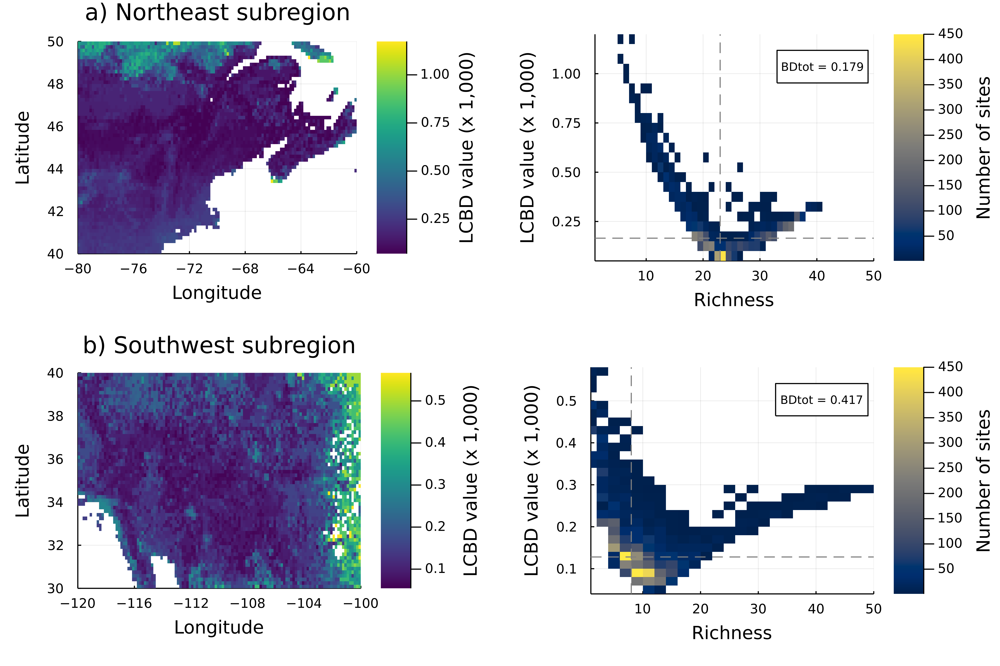

# Abstract (copy-paste from metadata, I just like having it here too 🙃)

Beta diversity is an essential measure to describe the organization of
biodiversity in space. The calculation of local contributions to beta diversity
(LCBD), specifically, allows for the identification of sites with exceptional
diversity within a region of interest. To this day, LCBD indices have mostly
been used on regional and smaller scales, with relatively few sites.
Furthermore, as beta diversity implies a comparison among the sites of a given
region, their use is typically restricted to strictly sampled sites with known
species composition, hence to discontinuous spatial scales. Here, we investigate
the variation of LCBD indices on extended spatial scales including both
species-poor and species-rich regions, and investigate their applicability for
continuous scales and unsampled sites through the use of species distribution
models (SDMs). To this aim, we used Bayesian additive regression trees (BARTs)
to model species composition on continuous scales based on observation data from
the eBird database. Our results highlight a changing relationship between site
richness and LCBD values for species-poor and species-rich regions depending on
the extent of the full region of interest. We also show that SDMs return
relevant LCBD predictions displaying the same relationship as the one obtained
with observation data only. Hence, our method could prove useful to identify
beta diversity hotspots in unsampled locations, which could be important targets
for conservation purposes.

# Introduction

Beta diversity, defined as the variation in species composition among sites in a
geographic region of interest [@Legendre2005AnaBet], is an essential measure
to describe the organization of biodiversity in space. Total beta diversity
within a community can be partitioned into local contributions to beta diversity
(LCBD) [@Legendre2013BetDiv], which allows for the identification of
sites with exceptional species composition, hence exceptional biodiversity. Such
a method, focusing on specific sites, is useful for both community ecology and
conservation biology, as it highlights areas that are most important for their
research or conservation values. However, the use of LCBD indices is currently
limited in two ways. First, LBCD indices are typically used on smaller regional
scales with relatively few sites, for example on fish communities at intervals
along a river stream [@Legendre2013BetDiv]. Second, LCBD calculation
methods require complete information on community composition, such as a
community composition matrix Y, thus they are inappropriate for partially
sampled sites, let alone for unsampled ones. Accordingly, the method is of
limited use to identify areas with exceptional biodiversity in regions with poor
and sparse sampling. However, predictive approaches are increasingly common
given recent development of computational methods, which often generate novel
ecological insights from existing data [@Poisot2019DatSyn] including for
unsampled or lesser-known locations, as well as larger spatial scales. Here, we
examine whether the LCBD method can be used to assess ecological uniqueness on
extended and continuous scales based on predictions of species distributions,
and evaluate whether this brings novel ecological insights regarding the
identification of exceptional biodiversity areas.

Ecological communities can be viewed as simply an assemblage of species. Such a
view opens the perspective of predicting community composition from predictions
of individual species, the aim of species distribution models (SDMs).
Community-level modelling from SDMs is not an especially novel idea
[@Ferrier2002ExtSta; @Ferrier2006SpaMod], but it is increasingly relevant with
the advent of large-scale, massive, and open data sources on species
occurrences, often contributed by citizens, such as eBird and GBIF. At their
core, SDMs aim to predict the distribution of a species based on information
about where the species was previously reported, matched with environmental data
at those locations, and then make predictions at other (unsampled) locations
based on their respective environmental conditions. Going from single-species
SDMs to a whole community is not a trivial task -- many alternatives have been
suggested, such as stacked species distribution models (SSDMs)
[@Ferrier2006SpaMod], spatially explicit species assemblage modelling (SESAM)
[@Guisan2011SesNew], joint species distribution models (JSDMs)
[@Pollock2014UndCoo], and hierarchical modeling of species communities (HMSC)
[@Ovaskainen2017HowMak]. Reasons behind these alternative methods vary, but
there are some reasons to believe that even S-SDMs, in a sense the most simple
and less community-specific method, provide reliable community predictions
[@Norberg2019ComEva; @Zurell2020TesSpe]. Regardless of the method used,
community-level analyses can be applied on the resulting community prediction
[@Ferrier2006SpaMod], something which has been lacking for measures other
than species richness [@Ferrier2006SpaMod]. This is true for the framework
of local contributions to beta diversity (LCBD) [@Legendre2013BetDiv],
measuring the uniqueness of communities, which to our knowledge has never been
applied on SDM results. 

However, applying local contributions to beta diversity on SDM predictions
raises the issue of calculating the uniqueness scores on much larger community
matrices. The total number of sites will increase because of (i) the continuous
scale of the predictions, as there will be more sites in the region of interest
now that it is not restricted to sampled ones, and (ii)  because of the larger
spatial extent allowed by SDM predictions. As mentioned earlier, LCBD scores are
normally used on relatively few sites on regional scales (although some studies
did apply it on near continental ones [@Poisot2017HosPar; @Taranu2020LarMul],
the total number of sites was relatively low). Having a lot of sites as well as
a large extent opens up the possibility of capturing a lot of variability of
habitats­ and community composition, but also a great number of very similar
ones, which could possibly change the way that exceptional sites contribute to
the overall variance in the large-scale community.

Measuring ecological uniqueness from LCBD indices on extended continuous scales
also raises the question of which sites will be identified as exceptional, and
for what reason. The intent of the method is that sites should stand out and
receive a high LCBD score whenever they display an exceptional community
composition, be it a unique assemblage of species, or a richer or poorer
community than most in the region. However, empirical studies have shown a
decreasing relationship between LCBD scores and species richness
[@Heino2017ExpSpe]. In other words, the method tends to identify the poorest
sites as the most exceptional ones. This remains to be shown on extended
continuous scales, as overall beta diversity is strongly dependent on scale,
therefore the relationship could potentially be different in such a case.

This study shows that species distribution modelling predictions offer relevant
LCBD and community-level predictions on extended spatial scales, similar to the
ones obtained from occurrence data, hereby providing uniqueness assessments in
poorly sampled regions. Our results further highlight a changing relationship
between site richness and LCBD values for species-poor and species-rich regions
depending on the extent of the full region of interest., showing that the
relationship is dependent on the region and the scale at which it is used,
Hence, our method could prove useful to identify beta diversity hotspots in
unsampled locations, which could be important targets for conservation purposes.

# Methods

We measured how compositional uniqueness varies on extended continuous scales.
We first predicted species composition on continuous scales using extended
occurrence data from eBird and species distribution models. We then quantified
compositional uniqueness for both predicted and observed data, and compared the
relationship between uniqueness and richness for different regions and scales.
We used _Julia v1.5.3_ [@Bezanson2017JulFre] for most of the project, as well as
_R v4.0.2_ [@RCoreTeam2020RLan] for some specific steps. All the scripts used
for the analyses are available at
<https://github.com/gabrieldansereau/betadiversity-hotspots>.

## Occurrence data

We used occurrence data from eBird [@Sullivan2009EbiCit] downloaded through the
eBird Basic Dataset from June 2019 [@eBirdBasicDataset2019VerEbd]. We restricted
our analyses to the Warblers family (_Parulidae_) in North America (Canada,
United States, Mexico) using the _R_ package `auk` [@Strimas-Mackey2018AukEbi].
eBird is a semi-structured citizen science data set, meaning that observations
are reported as checklists of species detected in an observation run
[@Johnston2020AnaGui]. Observers can explicitly specify that their checklist
contains all species they could detect and identify during a sampling event, in
which case it is labelled as a "complete checklist". Using complete checklists
instead of regular checklists allows inferring non-detections in locations where
detection efforts did occur, which offers large performance gains in species
distribution models [@Johnston2020AnaGui]. Therefore, we selected the data from
the complete checklists only. Our final data set comprised 62 Warblers species
and nearly 23 million observations from 9 million checklists. Warblers are a
diverse group with a sufficient number of species, are popular among birders
given their charismatic aspect, are distributed in diverse areas, and are
present relatively everywhere in North America.

We then converted the occurrence data to a presence-absence format compatible
with community analyses. We considered every pixel from our 10 arc-minutes
environmental layers as a site. We then verified, for each species, if there was
a single observation in every site. We recorded the outcome as a binary value:
present (1) if a species was ever recorded in a site, and absent (0) if it
was not. Complete checklists ensure that these are non-detections, rather than
the species not being reported; hence we considered them as absence data,
similar to @Johnston2020AnaGui.

## Environmental data

Our environmental data consisted of climatic data from WorldClim 2.1
[@Fick2017Wor2N] and land cover data from the Copernicus Global Land Service
[@Buchhorn2019CopGlo]. The WorldClim data consists of spatially interpolated
monthly climate data for global land areas. We downloaded the data at a
resolution of 10 arc-minutes (around 18 km² at the equator), the coarsest
resolution available, using the _Julia_ package `SimpleSDMLayers.jl`
[@Dansereau2021SimJl]. The coarse resolution should mitigate potential
imprecisions in the eBird data regarding the extent of the sampled areas in each
observation checklist. We used the standard _bioClim_ variables, which represent
annual trends, ranges, and extremes of temperature and precipitation, but
selected only 8 out of the 19 ones to avoid redundancy among them (bio1, bio2,
bio5, bio6, bio12, bio13, bio14, bio15). The Copernicus data is a set of
variables representing 10 land cover classes (e.g. crops, tree, urban area) and
measured as a percentage of land cover fraction. The data is only available at a
finer resolution of 100m, which we downloaded directly from the website. We
coarsened it to the same 10 arc-minutes resolution as the WorldClim data by
averaging the cover fraction values of the pixels with `GDAL`
[@GDAL/OGRcontributors2021GdaOgr]. We first selected the 10 land cover variables
but later removed two of them (moss and snow) from our predictive models as
their cover fraction was 0% on all sites with Warblers observations; hence they
did not provide any predictive value to our SDM models.

## Species distribution models

We predicted species distribution on continuous scales from our presence-absence
data using Bayesian Additive Regression Trees (BARTs) [@Chipman2010BarBay], a
classification and regression trees method recently suggested for species
distribution modelling [@Carlson2020EmbSpe]. BARTs are sum-of-trees models,
conceptually similar to Boosted Regression Trees and Random Forest, but
following a Bayesian paradigm: trees are constrained as weak learners by priors
regarding structure and nodes, then fitting and inference is done through an
iterative Bayesian backfitting MCMC algorithm generating a posterior
distribution of predicted classification probabilities [@Chipman2010BarBay;
@Carlson2020EmbSpe]. We used the package `embarcadero` [@Carlson2020EmbSpe] in
_R_ to perform the BART models. We performed BARTs separately for all species
and estimated the probability of occurrence for all the sites in our region of
interest. We then converted the results to a binary outcome according to the
threshold that maximized the True Skill Statistic (TSS) for each species, as
suggested by @Carlson2020EmbSpe. 

## Quantification of ecological uniqueness

We used the method from @Legendre2013BetDiv to quantify compositional uniqueness
from overall beta diversity for both observed and predicted data. First, we
assembled the presence-absence data by site to form two site-by-species
community matrices, one from observed data, called $Y$ (39 091 sites by 62
species), and one from predicted data, called $\hat Y$ (99 609 sites by 62
species). We measured species richness per site as the sum of each row, i.e. the
number of species present. We removed the sites without any species from the
predicted community matrix $\hat Y$, for a new total of 92 117 sites (this was
not necessary for the observed community matrix $Y$, as it was, by design, only
composed of sites with at least one species present) and applied the Hellinger
transformation to both matrices, as recommended by @Legendre2013BetDiv for
presence-absence data. We then measured the local contributions to beta
diversity (LCBD), which quantify how much a specific site (a row in each matrix)
contributes to the overall variance in the community [@Legendre2013BetDiv]. High
LCBD values indicate a unique community composition, while low values indicate a
more common species set. We note that our LCBD values, which add up to 1 by
definition, were very low given the high number of sites in both $Y$ and $\hat
Y$. However, the relative difference between the scores matters more than the
absolute value to differentiate their uniqueness. Therefore, we decided to
report the LCBD values relative to the maximum value from each matrix Y, meaning
that the new maximum value was 1, and all other values represented fractions.

## Investigation of regional and scaling variation

We recalculated LCBD values on various subregions at different locations and
scales to investigate possible regional and scaling effects. First, we selected
two subregions of equivalent size (20 longitude degrees by 10 latitude degrees)
with two contrasting richness profiles to verify if the relationship between
species richness and LCBD values was similar. We selected a Northeast subregion,
mostly species-rich, and a Southwest subregion, mostly species-poor (for both
observed and predicted data). The coordinates of both subregions are shown on
@fig:subareas. Second, we recalculated the LCBD indices at three different
scales, starting with a focus on the Northeast subregion and progressively
extending the extent to encompass the Southwest subregion (@fig:scaling). We did
these two verifications with both the observed and predicted data but only
illustrate the results with the predicted data as both were qualitatively
similar.

# Results

## Species distribution models generate relevant community predictions

The species distribution models generated richness and uniqueness results that
matched those from observed data, comforting their potential to fill-in gaps in
poorly sampled regions ([@fig:richness]). Species richness from observation data
([@fig:richness_raw]) is higher on the East coast and lower on the West coast,
with many unsampled patches in the North, Midwest, and Southwest. Richness
results from SDM data ([@fig:richness_bart]) fill in most of the gaps while
still displaying higher richness on the East coast, as well as sites with few or
no species up North and in the Midwest. There is no clear latitudinal gradient
in richness, but rather an East-West one, with landmarks such as the Rockies and
croplands in the Midwest, which should be species-poor habitats, notably visible
on the maps, separating the East and West.

{#fig:richness_raw}

{#fig:richness_bart}

Distribution of species richness in North America, defined as the number of
Warblers species per site, where each site is a 10 arc-minutes pixel. The
occurrence observation data from eBird (a) and the SDM predictions from the
single-species BART models (b) were both transformed into presence-absence
data per species before calculating richness. Areas in light grey (not on the
colour scale) represent mainland sites with environmental data but without any
Warblers species present.

The SDM predictions highlighted similar results regarding the LCBD sites,
providing relevant measures to fill in gaps ([@fig:lcbd]). LCBD scores were low
on the East Coast, and higher on the border of sampled sites in the Midwest, as
well as in North and in the South where sites with observations were more sparse
([@fig:lcbd_raw]). Results from SDM predictions are similar, with lower LCBD
values in the East, and more unique sites in the Midwest region and Central
Mexico, as well as in some Northern regions ([@fig:lcbd_bart]). There is no
clear latitudinal gradient once again and the East-West contrast, while present,
is less clear than on the richness maps.

{#fig:lcbd_raw}

{#fig:lcbd_bart}

Distribution of the LCBD values in North America, calculated from the variance
of the site-by-species community matrix Y and scaled to the maximum value
observed. Occurrence observations from eBird (left) and single-species SDM
predictions (right) were converted into presence-absence data per species, then
the Hellinger transformation was applied before computing the LCBD indices.
Areas in light grey (not on the colour scale) represent mainland sites with
environmental data but without any Warblers species present.

## The relationship on extended spatial scales is broad and less clearly defined

The relationship between species richness and LCBD scores was decreasing on
extended continuous scales ([@fig:relationship]), as stated in earlier studiers;
however, the relationship is broad, poorly defined, and shows a lot of
variation. Both observed and predicted data follow this similar relationship,
but the relationship is even broader with the predicted data. The latter also
seems to capture an extra association for sites of medium richness, who can
sometimes reach higher LCBD values (e.g. 20 species and a LCBD score around 0.9
for predicted data, compared with a score around 0.6 for observed data). The
minimal LCBD values are also higher for predicted data than for observed data.

{#fig:relationship_raw}

{#fig:relationship_bart}

Relationship between the species richness and the LCBD value of each
site based on the occurrence observations from eBird (a) and the SDM
predictions (b). LCBD values were scaled to the maximum value observed after
applying Hellinger transformation.

## Uniqueness displays regional variation as two distinct profiles

The relationship between LCBD values and species richness displayed two
contrasting profiles in species-rich and species-poor regions ([@fig:subareas]).
In a species-rich region, such as the Northeastern region of our study extent
(North America), LCBD scores display a decreasing relationship with species
richness. Hence, the sites with the highest LCBD values, i.e. the unique ones in
terms of species composition, are the species-poor sites, while the species-rich
sites display lower LCBD scores. Therefore, our results show that the only way
for a site to stand out and "be exceptional" in such a region is to have few
species. Since most sites in the Northeastern region comprise between 20 to 30
warblers species, the richest ones with 40 species do not stand out and are not
as exceptional as the ones with 10 species or fewer. The Southwest subarea, on
the other hand, shows a different relationship. While the sites with the highest
LCBD values are once again the poorest ones in terms of species richness, the
decreasing relationship with richness is initially much sharper and displays a
more significant increase as richness reaches 20 species. Since most
sites only comprise around 10 species and few sites comprise more than 20, 
regions with 40 species stand out more and are more exceptional in such
species-poor regions than they would be in species-rich ones.

{#fig:subareas}

## Uniqueness depends on the scale on which it is measured

The LCBD-richness relationship shows some important variation when scaling up
and changing the region's study extent ([@fig:scaling]). On smaller scales,
starting with a species-rich region, the relationship is well-defined,
decreasing and curvilinear. However, as the scale increases and progressively
reaches species-poor regions, the relationship broadens, displays more variance,
and loses its clear definition while remaining generally decreasing. The
minimum relative LCBD values also increase, going from near zero to 0.3,
showing a higher contribution of the less exceptional sites to the overall
diversity on extended scales.

{#fig:scaling}

## Extra figures

    
    

Figure: Distribution of species richness in North America, defined as the number
of Warblers species per site (10 arc-minutes pixels). The raw occurrence
observations from eBird (left) and the SDM predictions from the single-species
BART models (right) were both transformed into presence-absence data per species
before calculating richness.

    
    

Figure: Distribution of the LCBD values in North America, calculated from the
variance of the site-by-species community matrix Y and scaled to the maximum
value observed. Occurrence observations from eBird (left) and single-species SDM
predictions (right) were converted into presence-absence data per species, then
the Hellinger transformation was applied before computing the LCBD indices.

    
    

Figure: Relationship between the species richness and the LCBD value of each
site based on the occurrence observations from eBird (left) and the SDM
predictions (right). LCBD values were scaled to the maximum value observed after
applying Hellinger transformation.

# Discussion

This result highlights an important aspect regarding the LCBD measure: contrary
to previous findings, it does not simply decrease with species richness. In
fact, the relationship with richness is not constant -- it actually depends on
the general profile of the region on which it is applied and whether or not
this region is species-poor or species-rich. A parabolic relationship was
actually expected when the measure was introduced, as both extremes should
normally stand out. An explanation for the previously observed results could be
that extremely rich sites are just much less ecologically possible. It is
unlikely that all species could be found in a single site given their different
niche preferences, while poor sites are much more feasible. These sites will
almost always contribute more to the variance, as measured by LCBD values.

# References
